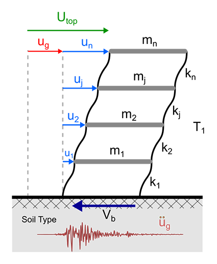
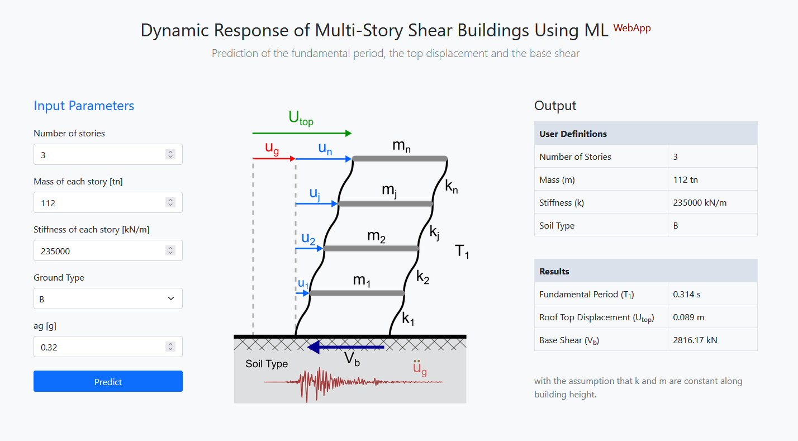

## Dynamic Response of Shear Buildings Using ML (DRSB-ML)

A web application for rapid predictions of the dynamic response of multi-story buildings, using optimized ML models based on gradient boosting on decision trees with categorical features support (CatBoost) alorithm. More specific the application is able to predict the fundamental eigenperiod (T1), the horizontal displacement at the top story (Utop) and the normalized shear base over the mass of each story (Vb) of a shear building (see figure below).

### Installation and Requirements
-----------------------------
First you need to create a new virtual environment based on Python version 3.9. After activating the new enviroment run the following command to install the required packages:

    pip install -r requirements

To use the application run the following:

    flask run

Visit http://localhost:5000 or http://127.0.0.1:5000 in your favorite browser to see the application running:

License
-------
DRSB-ML is released under the MIT license.

Author
------
Manolis Georgioudakis (geoem@mail.ntua.gr)

Copyright © 2023